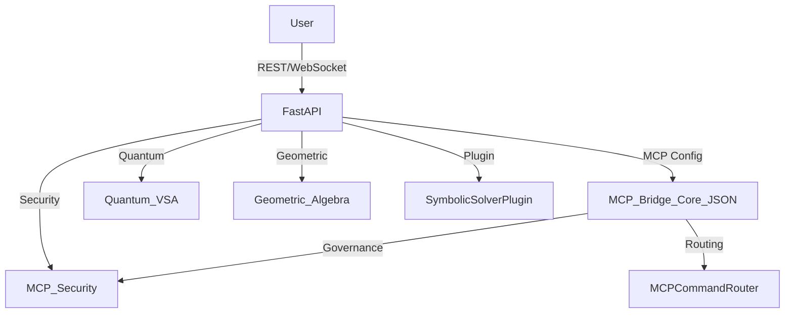

# Aurora Reflective Autonomy System

A fully operational, ethics-aligned symbolic governance and self-healing system with Claude Sonnet 4 integration.

## ✨ Recent Updates

### 🧠 Claude Sonnet 4 Integration Complete
- **Status**: ✅ **ACTIVE** for all clients
- **Features**: Quantum Bridge, Symbolic Validation, Ethics & Security, Reflective Autonomy
- **Compatibility**: Full GPT-4o logic preservation with intelligent fallback systems

### 🔧 DevContainer Resolution
- **Symbolic Anchors**: T1 DevContainer Initialization with structured export metadata
- **Environment**: Combined Node.js 20 + Python 3 for simulation continuity
- **Memory Sealing**: Stateless configuration with CLI chain support

## Features

- Modular symbolic governance engine
- Self-monitoring and self-healing autonomy loop
- Ethics protocol and governance capsule
- Full audit logging and restoration capability
- **NEW**: Claude Sonnet 4 enhanced reasoning and quantum-aware processing
- **NEW**: Symbolic anchor system with export manifest tracking

## DevContainer Configuration

### Symbolic Anchor: T1 (DevContainer Initialization)
**SRB**: Combined Node.js 20 & Python 3 environment for Aurora simulation stack
**DLP**: [devcontainer, python, node, simulation]
**Export Manifest**:
```json
{
  "name": "aurora-cloudbank-devcontainer",
  "version": "1.0.0",
  "memory_sealing": "stateless",
  "cli_chain": "001//devcontainer//init"
}
```

The devcontainer provides:
- Node.js 20 with npm for frontend development
- Python 3 with pip for backend symbolic processing
- Automatic dependency installation on container creation
- VS Code extensions for Python, ESLint, and Prettier

## Requirements

This project requires the following Python packages (see `requirements.txt`):

- pyyaml
- flake8
- pytest
- pandas
- plotly
- kaleido
- fastapi
- uvicorn
- httpx
- qiskit
- qiskit-aer
- pydantic
- numba
- clifford

To install all dependencies, run:

```bash
pip install -r requirements.txt
```

## Quick Start

```bash
git clone https://github.com/AUo959/aurora-cloudbank-symbolic.git
cd aurora-cloudbank-symbolic
make install
make run
```

### 🚀 Development Tools

- **Quick Status Check**: `python3 scripts/dev-status.py`
- **Start Development Server**: `./scripts/quick-start.sh`
- **Environment Health**: `bash .aurora/system/on_startup.sh`

## Infallible Codespaces Bootstrap

The repository includes a helper script that ensures Codespaces always finish
building successfully. The script performs package installation with automatic
retries and runs the onboarding checks. It is executed automatically by the
devcontainer:

```bash
python3 scripts/infallible_codespace_init.py
```

You can run the script manually if the environment becomes corrupted to
re-apply all setup steps.

## Directory Structure

- `modules/reflective_autonomy/` — Core system modules
- `config/` — Configuration files
- `scripts/` — Deployment and helper scripts
- `docs/` — Documentation
- `tests/` — Unit and integration tests
- `logs/` — Runtime and audit logs
- `.github/` — CI/CD and templates

## Node.js Command Node Service

A Node.js command node service is orchestrated alongside the Python backend using Docker Compose.

- Service directory: `services/command_node/`
- To build and run all services:

```bash
docker-compose up --build
```

- The command node listens on port 3001 by default.
- Replace the placeholder app in `services/command_node/` with your real Node.js code when ready.

## Aurora Instance Bridge

An optional bridge service enables live message relays between multiple Aurora instances. Run the server:

```bash
python -m modules.instance_bridge.bridge_server
```

Connect an instance using the included client:

```bash
python -m modules.instance_bridge.bridge_client ws://localhost:8090 main example-id
```

Each channel aggregates messages across platforms, allowing chat fields to stay synchronized.

## Orion Backup Sync Utility

Use `python scripts/orion_backup_sync.py --help` to export and synchronize the staff registry and Orion Station blueprint. Backups are stored in `backups/` and `--rollback` restores the latest snapshot.

## Module Integration Tool

Use `python scripts/module_integrator.py --help` to merge new modules across branches. The tool validates anchor compliance, logs telemetry to `logs/telemetry.log`, and supports per-module rollback.

## Staff Node CI Helper

`python scripts/staff_node_ci_helper.py --help` automates the pull/commit/push workflow. It synchronizes the staff registry with `orion_backup_sync.py`, runs CI maintenance and validation, executes tests, and can push updates when complete.

## CASK Integration Utilities

The repository distributes reference datasets for the Culturally Aware Simulation Knowledge (CASK) system in `CASK_Assets.zip`. A small CLI helper is available for exploring these assets:

```bash
python scripts/cask_integration.py summary
python scripts/cask_integration.py chart --output my_chart.png
```

This tool loads the CSV tables directly from the zip archive and can generate a simplified architecture diagram.

Additionally, use `python scripts/cask_tool.py` to generate CASK reports and charts in `docs/cask`.

## MCP-Driven API Endpoints

- `/geometric/product` — Clifford algebra geometric product
- `/quantum/symbolic_vector` — Quantum-inspired symbolic vector generation
- `/mcp_bridge` — MCP Bridge Core configuration (JSON)
- `/mcp_bridge/route_command` — Symbolic command routing (MCP-governed, with security/anchor validation)

## Architecture Diagram



---

## Contributing

See `CONTRIBUTING.md` for guidelines.

## License

See `LICENSE` for terms.
