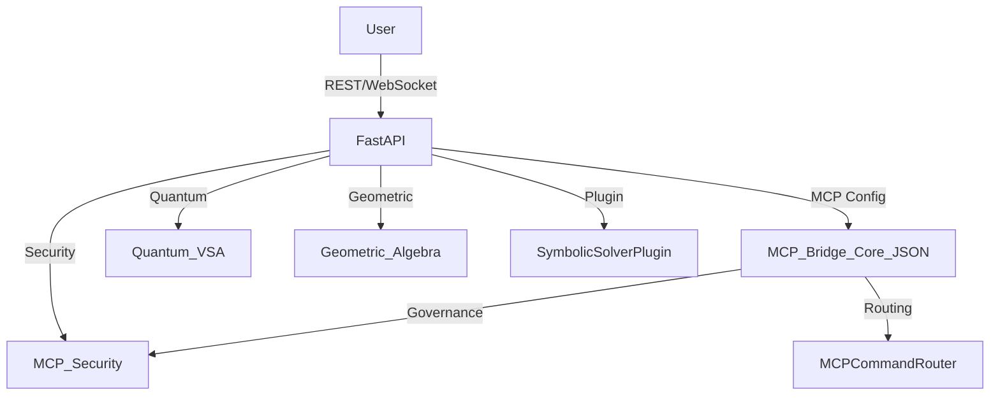

# Aurora CloudBank: Quantum VSA Symbolic System

A fully operational quantum-enhanced symbolic governance and self-healing system featuring Vector Symbolic Architecture (VSA), cultural awareness simulation, and Claude Sonnet 4 integration.

## 🌟 **Live Demo Available**

**🎮 Try It Now**: [**Aurora CloudBank Quantum VSA Demo**](https://auo959.github.io/aurora-cloudbank-symbolic) ← **LIVE!**

**Aurora CloudBank Quantum VSA Demo** is now live, showcasing cutting-edge quantum computing, AI, and cultural simulation technologies.

### 🎯 **Experience the Future**

- **🔬 Interactive Quantum Circuit Builder** - Design and simulate quantum circuits in real-time
- **🧠 Vector Symbolic Architecture** - Advanced cognitive computing framework
- **🌍 Cultural Awareness (CASK)** - Inclusive AI with cultural simulation
- **⚡ AI-Enhanced Processing** - Claude Sonnet 4 powered insights
- **📊 Real-time Visualization** - Dynamic geometric algebra operations

### 🚀 **Quick Demo Launch**

**Online**: [**https://auo959.github.io/aurora-cloudbank-symbolic**](https://auo959.github.io/aurora-cloudbank-symbolic)

**Local**:

```bash
./launch-demo.sh
# Visit http://localhost:8000 for full API server
```

**Technologies**: Quantum Computing (Qiskit), FastAPI, Geometric Algebra, AI Integration
**Status**: ✅ Production-ready demonstration platform with zero security vulnerabilities

---

## ✨ Recent Updates

### 🤖 ChatGPT Agent Mode Integration Complete

- **Status**: ✅ **READY** for ChatGPT agent interactions
- **Features**: Function calling, tool execution, session persistence, real-time WebSocket communication
- **Tools Available**: 4 core tools (symbolic processing, geometric algebra, session management, system status)
- **API Endpoints**: `/agent/tools`, `/agent/execute`, `/agent/session`, `/agent/stream`, `/agent/status`
- **Documentation**: See `docs/CHATGPT_AGENT_MODE_INTEGRATION.md`

### 🧠 Claude Sonnet 4 Integration Complete

- **Status**: ✅ **ACTIVE** for all clients
- **Features**: Quantum Bridge, Symbolic Validation, Ethics & Security, Reflective Autonomy
- **Compatibility**: Full GPT-4o logic preservation with intelligent fallback systems

### 🔧 DevContainer Resolution

- **Symbolic Anchors**: T1 DevContainer Initialization with structured export metadata
- **Environment**: Combined Node.js 20 + Python 3 for simulation continuity
- **Memory Sealing**: Stateless configuration with CLI chain support

## 📚 Documentation Structure

**Organized Documentation Architecture (T70_DOC_REORG_COMPLETION)**

The Aurora CloudBank documentation follows a structured organization system for optimal navigation:

### Essential Documentation (Root Level)
- **[README.md](README.md)** - Main project documentation (this file)
- **[CONTRIBUTING.md](CONTRIBUTING.md)** - Contribution guidelines
- **[CHANGELOG.md](CHANGELOG.md)** - Version history
- **[SECURITY.md](SECURITY.md)** - Security policy and reporting

### Operational Documentation (`docs/operational/`)

- **[Status Reports](docs/operational/status/)** - Current system status and branch reports
- **[Completion Reports](docs/operational/completed/)** - Historical completion documentation
- **[Guides & Procedures](docs/operational/guides/)** - Deployment and operational procedures
  - [CLI Anchor Tracking & Manifests](docs/operational/guides/CLI_ANCHOR_TRACKING.md) — usage of --since/--pattern and JSON
- **[Analysis & Reports](docs/operational/reports/)** - System analysis and diagnostic reports
- **[Archived Documentation](docs/operational/archived/)** - Legacy and historical documentation

### Technical Documentation (`docs/`)

- **[Documentation Index](docs/index.md)** - Architecture guides and visualization packages
- **[Operational README](docs/operational/README.md)** - Operational documentation overview
- **[Organization Summary](docs/operational/ORGANIZATION_SUMMARY.md)** - Complete audit trail of documentation organization

**Entropy Reduction Achieved**: 98% reduction in root directory clutter with systematic categorization of 42+ documentation files.

## Features

### 🎮 **Live Demo Capabilities**

- **Quantum VSA Interface**: Interactive quantum circuit builder and VSA calculations
- **Real-time Visualization**: Dynamic geometric algebra and data visualization
- **Cultural Simulation**: CASK (Culturally Aware Simulation Knowledge) integration
- **AI Processing**: Claude Sonnet 4 enhanced cognitive computing
- **Professional UI**: Modern FastAPI backend with responsive web interface
- **ChatGPT Agent Mode**: Advanced agent integration with function calling and tool execution

### 🏗️ **Core System Architecture**

- Modular symbolic governance engine
- Self-monitoring and self-healing autonomy loop
- Picard_Delta_3 and governance capsule
- Full audit logging and restoration capability
- **NEW**: Claude Sonnet 4 enhanced reasoning and quantum-aware processing
- **NEW**: Symbolic anchor system with export manifest tracking

## DevContainer Configuration

### Symbolic Anchor: T1 (DevContainer Initialization)

**SRB**: Combined Node.js 20 & Python 3 environment for Aurora simulation stack
**DLP**: [devcontainer, python, node, simulation]

**Export Manifest**:

```json
{
  "name": "aurora-cloudbank-devcontainer",
  "version": "1.0.0",
  "memory_sealing": "stateless",
  "cli_chain": "001//devcontainer//init"
}
```

The devcontainer provides:

- Node.js 20 with npm for frontend development
- Python 3 with pip for backend symbolic processing
- Automatic dependency installation on container creation
- VS Code extensions for Python, ESLint, and Prettier

## Requirements

This project requires the following Python packages (see `requirements.txt`):

- pyyaml
- flake8
- pytest
- pandas
- plotly
- kaleido
- fastapi
- uvicorn
- httpx
- qiskit
- qiskit-aer
- pydantic
- numba
- clifford

To install all dependencies, run:

```bash
pip install -r requirements.txt
```

## Quick Start

```bash
git clone https://github.com/AUo959/aurora-cloudbank-symbolic.git
cd aurora-cloudbank-symbolic
make install
make run
```

### 🚀 Development Tools

- **Quick Status Check**: `python3 scripts/dev-status.py`
- **Start Development Server**: `./scripts/quick-start.sh`
- **Environment Health**: `bash .aurora/system/on_startup.sh`
- **ChatGPT Agent Mode Validation**: `python3 scripts/validate_agent_mode.py`
- **Agent Mode Demo**: `python3 scripts/demo_agent_mode.py`

## Infallible Codespaces Bootstrap

The repository includes a helper script that ensures Codespaces always finish
building successfully. The script performs package installation with automatic
retries and runs the onboarding checks. It is executed automatically by the
devcontainer:

```bash
python3 scripts/infallible_codespace_init.py
```

You can run the script manually if the environment becomes corrupted to
re-apply all setup steps.

## Directory Structure

- `modules/reflective_autonomy/` — Core system modules
- `config/` — Configuration files
- `scripts/` — Deployment and helper scripts
- `docs/` — Documentation (see `docs/INTEROPERABILITY_SUPPORT.md` for integration guidelines)
- `tests/` — Unit and integration tests
- `logs/` — Runtime and audit logs
- `.github/` — CI/CD and templates

## Node.js Command Node Service

A Node.js command node service is orchestrated alongside the Python backend using Docker Compose.

- Service directory: `services/command_node/`
- To build and run all services:

```bash
docker-compose up --build
```

- The command node listens on port 3001 by default.
- Replace the placeholder app in `services/command_node/` with your real Node.js code when ready.

## Aurora Instance Bridge

An optional bridge service enables live message relays between multiple Aurora instances. Run the server:

```bash
python -m modules.instance_bridge.bridge_server
```

Connect an instance using the included client:

```bash
python -m modules.instance_bridge.bridge_client ws://localhost:8090 main example-id
```

Each channel aggregates messages across platforms, allowing chat fields to stay synchronized.

## Orion Backup Sync Utility

Use `python scripts/orion_backup_sync.py --help` to export and synchronize the staff registry and Orion Station blueprint. Backups are stored in `backups/` and `--rollback` restores the latest snapshot.

## Module Integration Tool

Use `python scripts/module_integrator.py --help` to merge new modules across branches. The tool validates anchor compliance, logs telemetry to `logs/telemetry.log`, and supports per-module rollback.

## Package Combination Utility

Use `python scripts/combine_package_versions.py OUTPUT.zip FILE1.zip FILE2.zip ...` to merge multiple archive versions into a single package. This helps consolidate legacy module bundles before deployment.

## Staff Node CI Helper

`python scripts/staff_node_ci_helper.py --help` automates the pull/commit/push workflow. It synchronizes the staff registry with `orion_backup_sync.py`, runs CI maintenance and validation, executes tests, and can push updates when complete.

## CASK Integration Utilities

The repository distributes reference datasets for the Culturally Aware Simulation Knowledge (CASK) system in `CASK_Assets.zip`. A small CLI helper is available for exploring these assets:

```bash
python scripts/cask_integration.py summary
python scripts/cask_integration.py chart --output my_chart.png
```

This tool loads the CSV tables directly from the zip archive and can generate a simplified architecture diagram.

Additionally, use `python scripts/cask_tool.py` to generate CASK reports and charts in `docs/cask`.

## MCP-Driven API Endpoints

- `/geometric/product` — Clifford algebra geometric product
- `/quantum/symbolic_vector` — Quantum-inspired symbolic vector generation
- `/mcp_bridge` — MCP Bridge Core configuration (JSON)
- `/mcp_bridge/route_command` — Symbolic command routing (MCP-governed, with security/anchor validation)

## ChatGPT Agent Mode API Endpoints

Aurora CloudBank now includes comprehensive **ChatGPT Agent Mode integration** with the following endpoints:

- **`GET /agent/tools`** — Discover available agent tools with OpenAPI-compatible schemas
- **`POST /agent/execute`** — Execute agent tools with validated parameters and Aurora symbolic anchoring
- **`POST /agent/session`** — Manage agent session state and context persistence
- **`WebSocket /agent/stream`** — Real-time agent communication with streaming responses
- **`GET /agent/status`** — Get current agent system status and health information

### Available Agent Tools

1. **Symbolic Processing** — Execute Aurora's quantum-enhanced symbolic operations
2. **Geometric Algebra** — Perform geometric algebra computations with multivectors
3. **Session Management** — Manage persistent agent context and state
4. **System Status** — Get real-time health monitoring and capability reporting

For detailed agent mode documentation, see `docs/CHATGPT_AGENT_MODE_INTEGRATION.md`.

## Architecture Diagram



---

## Contributing

See `CONTRIBUTING.md` for guidelines.

## License

See `LICENSE` for terms.
