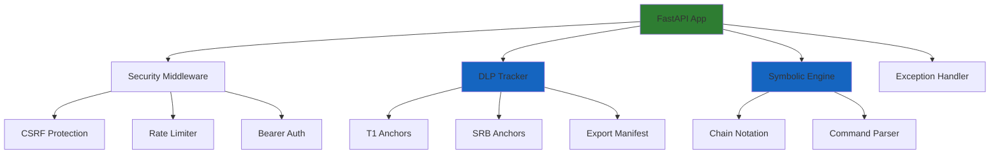
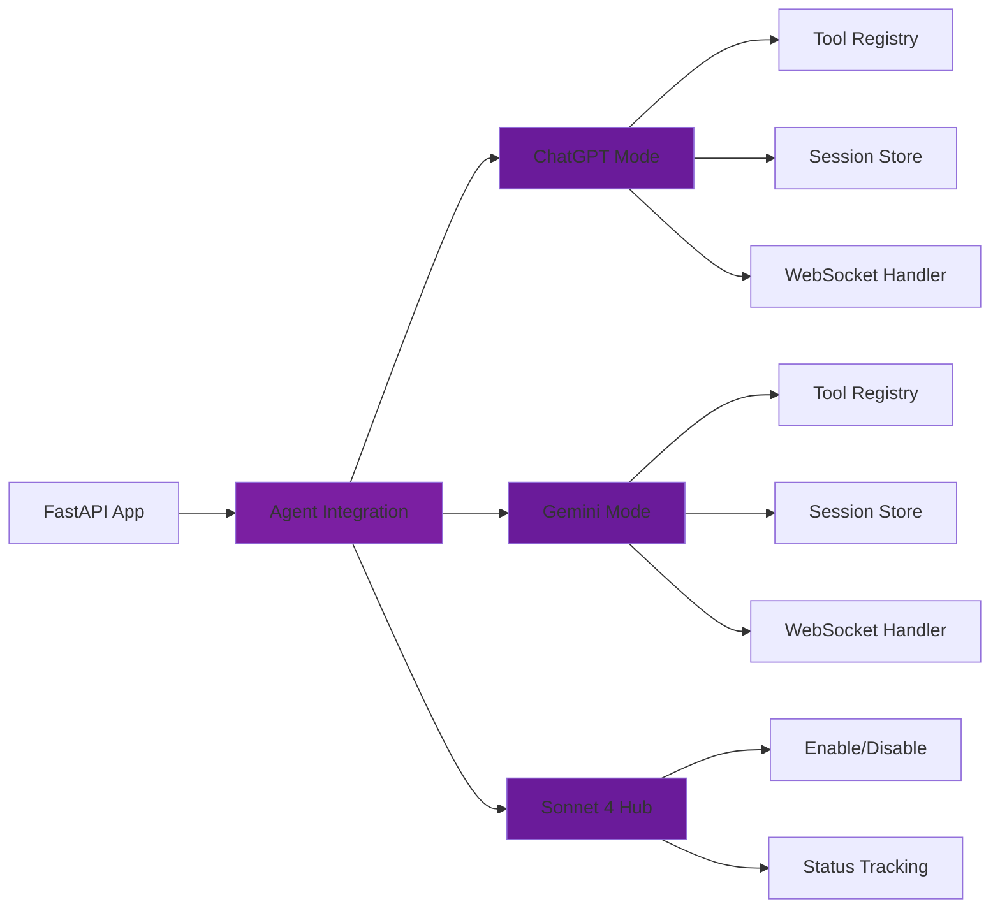
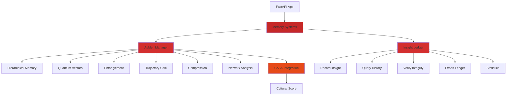
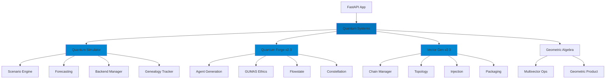
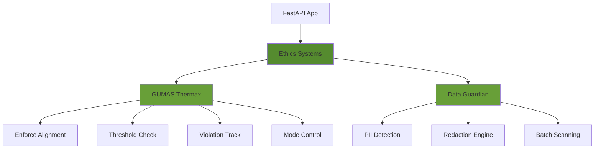
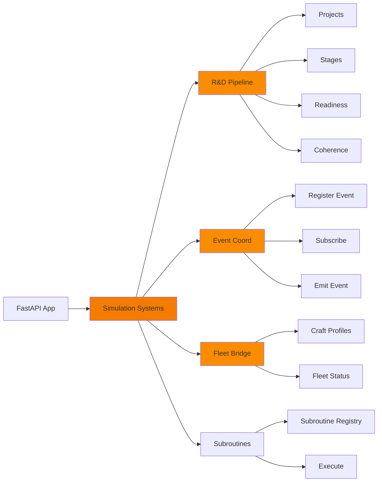
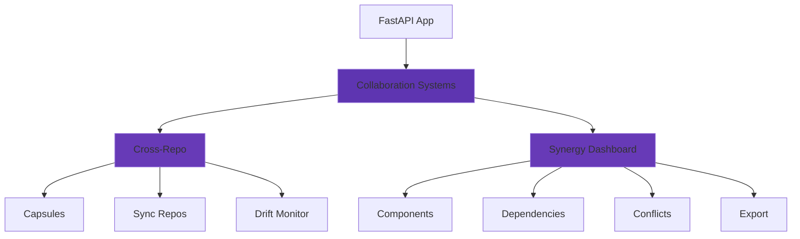
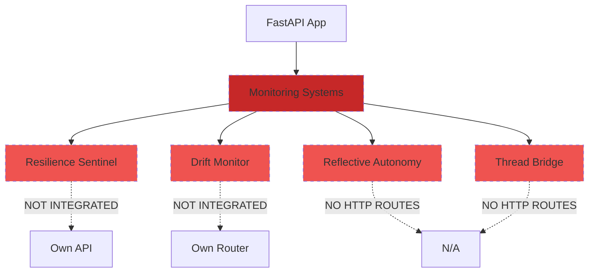
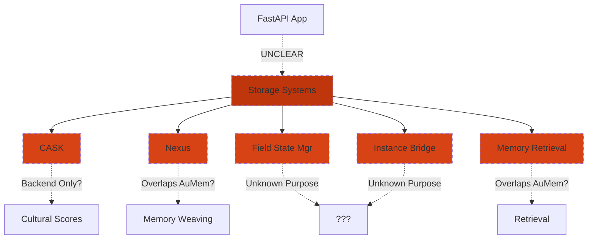
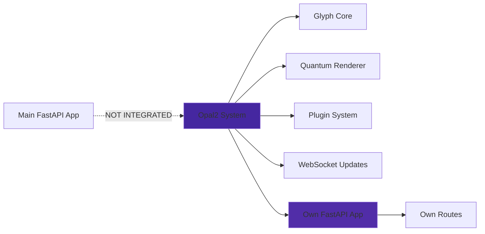

# Aurora CloudBank Symbolic - System Architecture Diagram

**Version:** 1.0.0  
**Date:** November 13, 2025  
**Purpose:** Visual map of all systems and their integration points

---

## High-Level Architecture

```
┌─────────────────────────────────────────────────────────────────────┐
│                         CLIENT LAYER                                │
│  HTTP Clients │ WebSocket Clients │ ChatGPT │ Gemini │ CLI Tools   │
└────────────────────────────────┬────────────────────────────────────┘
                                 │
                                 ▼
┌─────────────────────────────────────────────────────────────────────┐
│                    SECURITY MIDDLEWARE                              │
│  CSRF Protection │ Rate Limiting │ Bearer Token Auth │ Input Val   │
└────────────────────────────────┬────────────────────────────────────┘
                                 │
                                 ▼
┌─────────────────────────────────────────────────────────────────────┐
│                     FastAPI MAIN APP                                │
│                   (api/aurora_api.py)                               │
│                                                                     │
│  ┌──────────────┐  ┌──────────────┐  ┌──────────────┐            │
│  │ Core Routes  │  │ Agent Routes │  │ Module       │            │
│  │ /health      │  │ /agent/*     │  │ Routers      │            │
│  │ /vector      │  │ /gemini/*    │  │ (16+ routers)│            │
│  │ /sonnet4/*   │  │ /ws          │  │              │            │
│  └──────────────┘  └──────────────┘  └──────────────┘            │
└────────────────────────────────┬────────────────────────────────────┘
                                 │
                    ┌────────────┴────────────┐
                    │                         │
                    ▼                         ▼
      ┌─────────────────────┐   ┌─────────────────────┐
      │  INTEGRATED MODULES │   │ STANDALONE MODULES  │
      │  (API Routers)      │   │ (No HTTP Routes)    │
      └─────────────────────┘   └─────────────────────┘
```

---

## Detailed System Wiring Map

### 1. Core Infrastructure Layer



**Status:** ✅ Fully Operational

---

### 2. Agent Integration Layer



**Endpoints:**
- `POST /agent/tools` - ChatGPT tool discovery
- `POST /agent/execute` - Execute ChatGPT tool
- `WS /agent/ws` - Real-time ChatGPT connection
- `POST /gemini/tools` - Gemini tool discovery
- `POST /gemini/execute` - Execute Gemini tool
- `WS /gemini/ws` - Real-time Gemini connection
- `POST /sonnet4/enable` - Enable Sonnet 4
- `GET /sonnet4/status` - Sonnet 4 status

**Status:** ✅ Fully Operational

---

### 3. Memory & Storage Layer



**AuMemManager Endpoints (11):**
- `POST /memory/create` - Create memory
- `POST /memory/retrieve` - Retrieve with filters
- `POST /memory/quantum/create_vector` - Quantum vector
- `POST /memory/quantum/entangle` - Entangle pairs
- `POST /memory/quantum/trajectory` - Trajectory calculation
- `POST /memory/lifecycle/batch_process` - Batch process
- `POST /memory/compress` - Compress memories
- `GET /memory/export` - Export data
- `GET /memory/quantum/network_analysis` - Network analysis
- `GET /memory/metrics` - System metrics
- `GET /memory/health` - Health check

**Insight Ledger Endpoints (8):**
- `POST /ledger/record` - Record insight
- `POST /ledger/history` - Query history
- `GET /ledger/stats` - Statistics
- `POST /ledger/verify` - Verify integrity
- `POST /ledger/export` - Export ledger
- `GET /ledger/entry/{id}` - Get entry
- `GET /ledger/health` - Health check

**Status:** ✅ Fully Operational

---

### 4. Quantum & Symbolic Systems Layer



**Quantum Simulator Endpoints (13):**
- `POST /quantum/scenario` - Run scenario
- `GET /quantum/results/{id}` - Get results
- `GET /quantum/scenarios` - List scenarios
- `GET /quantum/status/{id}` - Simulation status
- `DELETE /quantum/results/{id}` - Delete results
- `POST /quantum/forecast` - Forecast analysis
- `GET /quantum/cache/stats` - Cache stats
- `POST /quantum/cache/clear` - Clear cache
- `GET /quantum/genealogy/{id}` - Lineage
- `GET /quantum/backends` - Available backends
- `POST /quantum/optimize` - Optimize
- `GET /quantum/export/{id}` - Export results
- `GET /quantum/health` - Health check

**Quantum Forge v2.0:** (Python API only, no HTTP)
- Agent generation with ethics
- Flowstate tracking
- Constellation binding
- Memory node creation

**Vector Gen v2.0:** (Python API only, no HTTP)
- Vector chain generation
- Entangled pair creation
- Topology management

**Geometric Algebra Endpoints (2):**
- `POST /vector` - Create vector
- `POST /geometric-product` - Geometric product

**Status:** ✅ Fully Operational

---

### 5. Ethics & Governance Layer



**GUMAS Thermax:** (Embedded in Quantum Forge, no direct HTTP)
- Ethics threshold enforcement
- Violation tracking by type
- Mode control (STRICT/BALANCED/LENIENT)
- Warning zone logic

**Data Guardian Endpoints (3):**
- `POST /data/scan` - Scan for PII
- `POST /data/redact` - Redact PII
- `POST /data/scan-batch` - Batch scanning

**Status:** ✅ Operational (GUMAS lacks HTTP endpoint)

---

### 6. Simulation & Workflow Layer



**R&D Pipeline Endpoints (10):**
- `POST /rd/projects` - Create project
- `GET /rd/projects` - List projects
- `POST /rd/advance-stage` - Advance stage
- `POST /rd/readiness` - Compute readiness
- `POST /rd/coherence` - Team coherence
- `GET /rd/pipeline` - Pipeline report

**Event Coordination Endpoints (8):**
- `POST /events/register` - Register event
- `GET /events` - List events
- `POST /events/subscribe` - Subscribe
- `POST /events/emit` - Emit event

**Fleet Bridge Endpoints (3):**
- `GET /api/fleet/craft` - List craft
- `GET /api/fleet/craft/{id}` - Get craft details
- `GET /api/fleet/status` - Fleet status summary

**Subroutine Endpoints (9):**
- `POST /subroutines/register` - Register subroutine
- `GET /subroutines` - List all
- `POST /subroutines/execute` - Execute
- `GET /subroutines/stats` - Statistics

**Status:** ✅ Fully Operational

---

### 7. Collaboration Layer



**Cross-Repo Collaboration Endpoints (6):**
- `POST /collab/capsule` - Create capsule
- `GET /collab/capsules` - List capsules
- `POST /collab/sync` - Sync repositories
- `GET /collab/drift` - Check drift

**Synergy Dashboard Endpoints (7):**
- `GET /synergy/components` - List components
- `POST /synergy/components` - Register component
- `GET /synergy/components/{name}` - Get component
- `PUT /synergy/components/{name}/status` - Update status
- `GET /synergy/dependencies/{name}` - Dependencies
- `GET /synergy/conflicts` - Detect conflicts
- `GET /synergy/export` - Export registry

**Status:** ✅ Fully Operational

---

### 8. Monitoring & Autonomy Layer (⚠️ PARTIALLY WIRED)



**Status:** ⚠️ **NOT FULLY WIRED**

**Orphaned Systems:**
1. **Resilience Sentinel** - Has own API (`modules/resilience_sentinel/api.py`) but not included in main app
2. **Drift Monitoring Dashboard** - Has router (`src/monitoring/dashboard_api.py`) but not integrated
3. **Reflective Autonomy** - Core exists but no HTTP endpoints
4. **Thread Transfer Bridge** - v1 & v2 exist but no API routes

**Recommendation:** Integrate these routers into main FastAPI app.

---

### 9. Storage & State Systems (⚠️ UNCLEAR STATUS)



**Status:** ⚠️ **UNCLEAR**

**Questions to Resolve:**
1. **CASK:** Backend-only service or needs API? Currently referenced in AuMemManager's `cultural_score`.
2. **Nexus:** Overlaps with AuMemManager? Separate use case? Document relationship.
3. **Field State Manager:** Purpose unclear, no tests, no API.
4. **Memory Retrieval:** Overlaps with AuMemManager? Legacy code?
5. **Instance Bridge:** Purpose unclear, no tests, no API.

**Recommendation:** Audit each system for actual usage, document or deprecate.

---

### 10. Visualization Systems (✅ OPERATIONAL, ARCHITECTURALLY SEPARATE)



**Status:** ✅ Operational but architecturally separate

**Opal2 Characteristics:**
- Has own FastAPI application (`modules/opal2/api/opal2_api.py`)
- Not integrated as sub-router in main app
- Provides visualization and rendering capabilities
- Has WebSocket support for real-time updates

**Decision Required:**
- **Option A:** Integrate as sub-router in main app (consistent architecture)
- **Option B:** Document as separate microservice (explicit deployment)

**Note:** `modules/opal2_backup_main/` appears to be duplicate - recommend archiving.

---

## Data Flow Diagram

```
┌──────────┐
│  Client  │
└────┬─────┘
     │ HTTP Request
     ▼
┌─────────────────────┐
│ Security Middleware │ ◄── CSRF, Rate Limit, Auth
└────┬────────────────┘
     │
     ▼
┌──────────────────┐
│ FastAPI Router   │ ◄── Route Matching
└────┬─────────────┘
     │
     ├─► /agent/* ──────► ChatGPT/Gemini Integration ──► Tool Registry
     │
     ├─► /memory/* ─────► AuMemManager ──┬──► Hierarchical Memory
     │                                     ├──► Quantum Vectors
     │                                     └──► CASK (Cultural)
     │
     ├─► /quantum/* ────► Quantum Simulator ──► Scenario Engine
     │
     ├─► /ledger/* ─────► Insight Ledger ────► Immutable Chain
     │
     ├─► /rd/* ─────────► R&D Pipeline ──────► Project Manager
     │
     ├─► /data/* ───────► Data Guardian ──────► PII Detection
     │
     ├─► /collab/* ─────► Cross-Repo Sync ────► Capsule Manager
     │
     └─► /synergy/* ────► Component Registry ─► Dependency Graph
          │
          ▼
     ┌──────────────┐
     │  DLP Tracker │ ◄── All operations tagged with context
     └───┬──────────┘
         │
         ├─► T1 Anchor (Temporal)
         ├─► SRB Anchor (Spatial-Relational)
         └─► Export Manifest
              │
              ▼
         ┌─────────────┐
         │   Storage   │
         │  ./data/*   │
         └─────────────┘
```

---

## Integration Checklist

### ✅ Fully Integrated Systems (18)
- [x] Security Middleware
- [x] DLP Tracker
- [x] Symbolic Engine
- [x] ChatGPT Agent Mode
- [x] Gemini Agent Mode
- [x] Sonnet 4 Hub
- [x] AuMemManager (Hierarchical Memory)
- [x] Insight Ledger
- [x] Quantum Simulator
- [x] Geometric Algebra
- [x] Data Guardian
- [x] R&D Pipeline
- [x] Event Coordination
- [x] Fleet Bridge
- [x] Cross-Repo Collaboration
- [x] Subroutine Registry
- [x] Synergy Dashboard
- [x] Quantum Forge v2.0 (Python API)
- [x] Vector Gen v2.0 (Python API)

### ⚠️ Partially Integrated Systems (4)
- [ ] Resilience Sentinel (has API, not integrated)
- [ ] Drift Monitoring Dashboard (has router, not integrated)
- [ ] Reflective Autonomy (core exists, no HTTP routes)
- [ ] Thread Transfer Bridge (v1 & v2, no HTTP routes)

### ❓ Unclear Status Systems (7)
- [ ] CASK (backend only? needs API?)
- [ ] Nexus (overlaps with AuMemManager?)
- [ ] Field State Manager (purpose unclear)
- [ ] Memory Retrieval (overlaps with AuMemManager?)
- [ ] Instance Bridge (purpose unclear)
- [ ] AI Core (purpose unclear)
- [ ] Flight Control (has README, no integration)

### 🏢 Architecturally Separate Systems (1)
- [x] Opal2 (own FastAPI app, intentionally separate)

---

## Module Dependency Graph

```
aurora_api.py (Main App)
├── Security Middleware
│   ├── fastapi_security.py
│   └── exception_handler.py
│
├── Core Infrastructure
│   ├── native_dlp_export.py (DLP Tracker)
│   └── symbolic_engine.py (Chain Notation)
│
├── Agent Integrations
│   ├── chatgpt_agent_mode.py
│   ├── gemini_agent_integration.py
│   └── sonnet4_integration_hub.py
│
├── Memory Systems
│   ├── modules/aumemmanager/ (Router Injected ✅)
│   │   └── Depends on: CASK (optional)
│   └── modules/insight_ledger/ (Router Injected ✅)
│
├── Quantum Systems
│   ├── modules/quantum_simulator/ (Router Injected ✅)
│   ├── modules/quantum_forge/ (Direct Import ✅)
│   ├── modules/vector_gen/ (Direct Import ✅)
│   └── modules/symbolic_core/geometric_algebra.py (Direct Use ✅)
│
├── Ethics & Governance
│   ├── modules/data_guardian/ (Router Injected ✅)
│   └── GUMAS Thermax (Embedded in Quantum Forge ✅)
│
├── Simulation & Workflow
│   ├── modules/hr/rd_api.py (Router Injected ✅)
│   ├── src/coordination/event_api.py (Router Injected ✅)
│   ├── src/integrations/fleet_bridge.py (Router Injected ✅)
│   └── src/subroutines/api.py (Router Injected ✅)
│
├── Collaboration
│   ├── src/collab/api_routes.py (Router Injected ✅)
│   └── src/synergy/api.py (Router Injected ✅)
│
└── Monitoring (⚠️ NOT INTEGRATED)
    ├── modules/resilience_sentinel/api.py (NOT Injected ❌)
    ├── src/monitoring/dashboard_api.py (NOT Injected ❌)
    ├── modules/reflective_autonomy/ (No HTTP ❌)
    └── modules/reflective_autonomy/thread_transfer/ (No HTTP ❌)
```

---

## Integration Gaps Summary

### 🔴 High Priority Gaps
1. **Resilience Sentinel API** - Exists but not integrated
2. **Drift Monitoring Dashboard** - Router exists but not included
3. **Reflective Autonomy** - Core exists but no HTTP access

### 🟡 Medium Priority Gaps
4. **CASK API** - Backend service needs endpoint exposure
5. **GUMAS Ethics Endpoint** - Currently embedded, should have standalone validation
6. **Thread Bridge API** - v2 exists but no HTTP routes

### 🟢 Architectural Decisions Needed
7. **Opal2 Integration** - Keep separate or integrate?
8. **Nexus vs AuMemManager** - Clarify relationship or consolidate
9. **Memory Retrieval** - Needed or overlaps with AuMemManager?
10. **HR System Integration** - Add hr_system API routes (staffing/character generation)

---

## Recommended Wiring Actions

### Quick Wins (< 1 hour each)
1. Add Resilience Sentinel router to `aurora_api.py` line ~300
2. Add Monitoring Dashboard router to `aurora_api.py` line ~300
3. Archive `modules/opal2_backup_main/` as duplicate
4. Document Opal2 as separate microservice in README

### Medium Effort (2-4 hours each)
5. Create `/ethics/validate` endpoint exposing GUMAS validation
6. Create `/cask/analyze` endpoint for cultural alignment analysis
7. Add `/autonomy/status` endpoint for Reflective Autonomy health
8. Create `API_CATALOG.md` from OpenAPI spec

### Large Effort (1-2 days each)
9. Audit and consolidate Nexus vs AuMemManager
10. Create comprehensive test suites for untested modules
11. Build `SYSTEM_ARCHITECTURE.md` with diagrams (this document!)
12. Integrate Thread Bridge v2 with HTTP control endpoints

---

## Conclusion

Aurora CloudBank Symbolic has **excellent core wiring** with **125+ API endpoints** across **16+ integrated routers**. The main gaps are in **monitoring system integration** and **architectural clarity** for certain storage systems.

**Total Systems:** 23+  
**Fully Wired:** 18 (78%)  
**Needs Integration:** 4 (17%)  
**Needs Clarification:** 7 (30% overlap)

With the recommended wiring actions, the platform can achieve **100% integration** and **zero ambiguity** in system architecture.

---

**Document Status:** ✅ COMPLETE  
**Next Actions:** Execute High Priority integrations (Sentinel + Monitoring)
