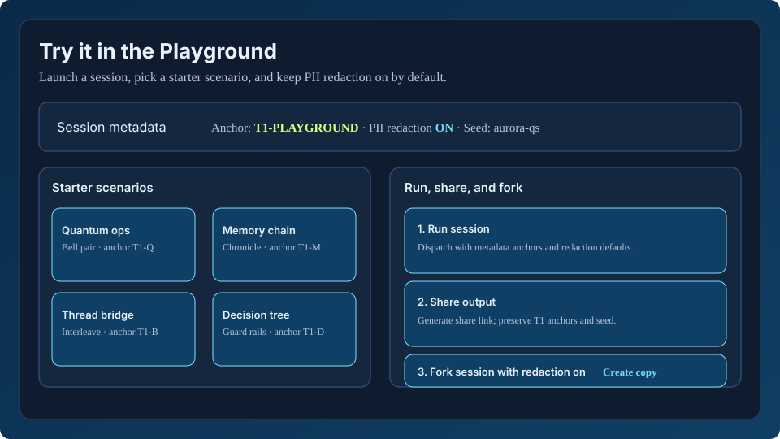

# Aurora Frontend

**Production-grade complex systems simulation platform**

A cutting-edge React + TypeScript frontend for Aurora CloudBank Symbolic, enabling high-fidelity simulations of complex systems, quantum memory exploration, multi-agent research, and real-time compliance monitoring.

---

## Quick Start

```bash
# Install dependencies
npm install

# Start development server
npm run dev

# Build for production
npm run build

# Preview production build
npm run preview
```

Visit **http://localhost:5173** in your browser.

---

## Try it in the Playground

1. `npm run dev -- --host --port 5173`
2. Open **http://localhost:5173/playground**
3. Load a starter scenario from the gallery (quantum, memory, thread bridge, decision) with **T1 anchors**.
4. Confirm the default PII redaction payload is present (`strategy: mask`, fields: `full_name`, `email`, `phone`).
5. Use the share/fork examples to validate continuity before committing a session to collaborators.



---

## Features

### ✅ Implemented

1. **System Dashboard** (`/`)
   - Real-time system metrics
   - Memory, quantum, and agent statistics
   - Performance monitoring
   - Activity feed
   - Quick actions

2. **AI Agent Console** (`/agent`)
   - **Split-pane interface**: Chat + System Internals
   - Real-time chat with Aurora AI partner
   - Memory retrieval visualization
   - Model selection display (Claude/GPT)
   - Ethics scoring and compliance monitoring
   - Drift detection alerts
   - Token usage tracking

3. **Root Layout**
   - Collapsible sidebar navigation
   - Aurora gradient design system
   - Responsive layout
   - Dark theme

4. **Core Infrastructure**
   - React 18 + TypeScript 5.3
   - Vite build system
   - React Query for server state
   - Tailwind CSS + custom design system
   - Type-safe API client
   - Toast notifications (Sonner)
   - Comprehensive utility functions

### 🚧 Planned (Stub Pages Created)

5. **3D Memory Topology Visualizer** (`/memory`)
   - React Three Fiber 3D visualization
   - 56K+ memory nodes
   - Quantum entanglement links
   - Interactive exploration

6. **Compliance Dashboard** (`/compliance`)
   - Audit trail timeline
   - PII detection demo
   - Cryptographic verification
   - DLP tracking
   - Exportable reports

7. **Orion Station** (`/orion`)
   - Multi-agent research hub
   - Agent fleet management
   - Research task board
   - Autonomous experiments
   - Collaboration graph

8. **Developer Playground** (`/playground`)
   - Interactive API explorer
   - Code generator (Python/JS/cURL)
   - Request builder
   - WebSocket tester
   - Example gallery

9. **Complex System Simulations** (`/simulations`)
   - Simulation builder
   - Agent designer
   - Environment configuration
   - Real-time monitoring
   - Results analysis

---

## Tech Stack

### Core
- **React 18.2** - UI library with concurrent features
- **TypeScript 5.3** - Type safety
- **Vite 5.0** - Build tool with HMR

### State Management
- **React Query (TanStack Query)** - Server state, caching
- **Zustand** - Client state (planned for complex forms)

### Styling
- **Tailwind CSS 3.4** - Utility-first CSS
- **Radix UI** - Unstyled accessible components
- **class-variance-authority** - Component variants
- **Framer Motion** - Animations (planned)

### 3D Graphics (Planned)
- **Three.js** - WebGL 3D engine
- **React Three Fiber** - React renderer for Three.js
- **@react-three/drei** - R3F helpers

### Data Visualization
- **Recharts** - Declarative charts
- **D3.js** - Advanced visualizations (planned)

### Development
- **ESLint** - Linting
- **Prettier** - Code formatting
- **Vitest** - Unit testing (configured)
- **Playwright** - E2E testing (configured)

---

## Project Structure

```
frontend/
├── public/                   # Static assets
├── src/
│   ├── app/                  # Application root
│   │   ├── App.tsx           # Main app component
│   │   ├── router.tsx        # React Router config
│   │   └── providers.tsx     # Context providers
│   ├── pages/                # Route pages
│   │   ├── Dashboard/        # System dashboard ✅
│   │   ├── AgentConsole/     # AI agent chat ✅
│   │   ├── MemoryVisualizer/ # 3D memory viz 🚧
│   │   ├── ComplianceDashboard/ # Audit trails 🚧
│   │   ├── OrionStation/     # Multi-agent hub 🚧
│   │   ├── Playground/       # Developer tools 🚧
│   │   └── Simulations/      # System simulations 🚧
│   ├── components/           # Reusable components
│   │   ├── ui/               # UI primitives (Button, Card)
│   │   ├── layout/           # Layout components (RootLayout)
│   │   └── common/           # Common components (LoadingScreen)
│   ├── lib/                  # Utilities and configs
│   │   ├── api/              # API client ✅
│   │   │   ├── client.ts     # Axios client with auth
│   │   │   └── aurora.ts     # Aurora API methods
│   │   └── utils.ts          # Helper functions ✅
│   ├── types/                # TypeScript types
│   │   └── aurora.ts         # Complete Aurora types ✅
│   ├── styles/               # Global styles
│   │   └── globals.css       # Tailwind + custom CSS ✅
│   └── main.tsx              # Entry point
├── ARCHITECTURE.md           # Technical architecture doc
├── package.json
├── tsconfig.json
├── vite.config.ts
├── tailwind.config.ts
└── README.md                 # This file
```

---

## Design System

### Colors

**Primary (Quantum Blue)**
- Used for primary actions, links, quantum features
- `#3b82f6` (primary-500)

**Secondary (Neural Purple)**
- Used for secondary actions, AI/neural features
- `#a855f7` (secondary-500)

**Accent (Aurora Cyan)**
- Used for highlights, accents, special states
- `#06b6d4` (accent-500)

**Semantic**
- Success: `#10b981` (green)
- Warning: `#f59e0b` (amber)
- Error: `#ef4444` (red)
- Info: `#3b82f6` (blue)

### Typography

- **Sans-serif**: Inter (body text)
- **Monospace**: JetBrains Mono (code, data)
- **Display**: Space Grotesk (headings)

### Custom Classes

```css
.text-gradient          /* Multi-color gradient text */
.aurora-gradient        /* Background gradient */
.glass-morphism         /* Frosted glass effect */
.quantum-glow           /* Blue glow effect */
.neural-glow            /* Purple glow effect */
```

---

## API Integration

### Environment Variables

Create `.env` file (see `.env.example`):

```env
VITE_API_BASE_URL=http://localhost:8000
VITE_WS_URL=ws://localhost:8000
```

### API Client Usage

```typescript
import { auroraAPI } from '@/lib/api/aurora';

// Memory operations
const memories = await auroraAPI.memory.retrieve({
  query: "quantum entanglement",
  top_k: 5
});

// Quantum simulation
const result = await auroraAPI.quantum.simulate({
  scenario_type: "supply_chain",
  parameters: { num_locations: 10 }
});

// AI agent chat
const response = await auroraAPI.agent.chat({
  content: "Explain quantum computing",
  use_memory: true
});
```

### React Query Hooks

```typescript
import { useQuery, useMutation } from '@tanstack/react-query';

// Fetch data
const { data, isLoading } = useQuery({
  queryKey: ['metrics'],
  queryFn: () => auroraAPI.system.metrics(),
  refetchInterval: 5000  // Auto-refresh every 5s
});

// Mutate data
const sendMessage = useMutation({
  mutationFn: (msg) => auroraAPI.agent.chat(msg),
  onSuccess: (data) => {
    console.log('Message sent:', data);
  }
});
```

---

## Development Guide

### Adding a New Page

1. **Create page component**:
```typescript
// src/pages/MyFeature/index.tsx
export default function MyFeature() {
  return (
    <div className="h-full p-8">
      <h1 className="text-4xl font-display font-bold text-gradient">
        My Feature
      </h1>
      {/* Content */}
    </div>
  );
}
```

2. **Add route** in `src/app/router.tsx`:
```typescript
const MyFeature = lazy(() => import('@/pages/MyFeature'));

// In routes array:
{
  path: 'my-feature',
  element: <SuspenseWrapper><MyFeature /></SuspenseWrapper>
}
```

3. **Add navigation** in `src/components/layout/RootLayout.tsx`:
```typescript
const navigation = [
  // ...
  { name: 'My Feature', href: '/my-feature', icon: Star },
];
```

### Creating Components

Use the shadcn/ui pattern:

```typescript
import { forwardRef } from 'react';
import { cn } from '@/lib/utils';

interface MyComponentProps {
  variant?: 'default' | 'special';
  className?: string;
}

const MyComponent = forwardRef<HTMLDivElement, MyComponentProps>(
  ({ variant = 'default', className, ...props }, ref) => {
    return (
      <div
        ref={ref}
        className={cn(
          'base-classes',
          variant === 'special' && 'special-classes',
          className
        )}
        {...props}
      />
    );
  }
);

MyComponent.displayName = 'MyComponent';
export { MyComponent };
```

### TypeScript Best Practices

1. **Use strict types** - No `any` unless absolutely necessary
2. **Define interfaces** for all API responses in `src/types/aurora.ts`
3. **Use utility types**: `Partial<T>`, `Pick<T, K>`, `Omit<T, K>`
4. **Type component props** explicitly

```typescript
interface ButtonProps extends React.ButtonHTMLAttributes<HTMLButtonElement> {
  isLoading?: boolean;
  variant?: 'default' | 'quantum' | 'neural';
}
```

---

## Building Production Features

### 3D Memory Visualizer (Next Priority)

**Tech**: React Three Fiber + drei

**Implementation**:
```typescript
// src/pages/MemoryVisualizer/MemoryScene.tsx
import { Canvas } from '@react-three/fiber';
import { OrbitControls, PerspectiveCamera } from '@react-three/drei';

export function MemoryScene() {
  return (
    <Canvas>
      <PerspectiveCamera makeDefault position={[0, 0, 100]} />
      <OrbitControls />
      <ambientLight intensity={0.5} />

      {/* Memory nodes */}
      {memories.map(mem => (
        <MemoryNode
          key={mem.id}
          position={mem.position}
          importance={mem.importance}
          onClick={() => selectMemory(mem)}
        />
      ))}

      {/* Entanglement links */}
      {entanglements.map(link => (
        <EntanglementEdge
          key={link.id}
          start={link.start}
          end={link.end}
        />
      ))}
    </Canvas>
  );
}
```

**Data**:
- Fetch memories with `auroraAPI.memory.retrieve()`
- Use force-directed graph layout (D3-force or custom)
- Render with instanced meshes for performance

---

## Performance Optimization

### Code Splitting

Already configured via React.lazy():

```typescript
const Dashboard = lazy(() => import('@/pages/Dashboard'));
// Loads only when route is accessed
```

### React Query Caching

Configured with sensible defaults:

```typescript
{
  staleTime: 60 * 1000,      // Data fresh for 1 minute
  gcTime: 5 * 60 * 1000,     // Cache for 5 minutes
  retry: 1,                   // Retry failed requests once
  refetchOnWindowFocus: false // Don't refetch on tab focus
}
```

### Bundle Size

Vite automatically code-splits vendors:

```typescript
manualChunks: {
  'react-vendor': ['react', 'react-dom', 'react-router-dom'],
  'three-vendor': ['three', '@react-three/fiber', '@react-three/drei'],
  'ui-vendor': ['@radix-ui/...'],
  'chart-vendor': ['recharts', 'd3'],
}
```

---

## Testing

### Unit Tests (Vitest)

```bash
npm test                # Run all tests
npm run test:ui         # Open Vitest UI
npm run test:coverage   # Generate coverage report
```

**Example**:
```typescript
// src/lib/utils.test.ts
import { describe, it, expect } from 'vitest';
import { formatDuration } from './utils';

describe('formatDuration', () => {
  it('formats milliseconds', () => {
    expect(formatDuration(500)).toBe('500ms');
  });

  it('formats seconds', () => {
    expect(formatDuration(2500)).toBe('2.5s');
  });
});
```

### E2E Tests (Playwright)

```bash
npm run test:e2e
```

**Example**:
```typescript
// tests/e2e/dashboard.spec.ts
import { test, expect } from '@playwright/test';

test('dashboard loads and shows metrics', async ({ page }) => {
  await page.goto('/');
  await expect(page.getByText('Aurora Dashboard')).toBeVisible();
  await expect(page.getByText('Quantum Memory')).toBeVisible();
});
```

---

## Deployment

### Vercel (Recommended)

1. **Install Vercel CLI**:
```bash
npm i -g vercel
```

2. **Deploy**:
```bash
vercel deploy --prod
```

3. **Environment Variables**:
Add in Vercel dashboard:
- `VITE_API_BASE_URL`
- `VITE_WS_URL`

### Docker

```bash
# Build image
docker build -t aurora-frontend .

# Run container
docker run -p 3000:3000 aurora-frontend
```

### Static Hosting

```bash
npm run build
# Deploy dist/ folder to any static host (Netlify, Cloudflare Pages, etc.)
```

---

## Roadmap

### Phase 1: Core Features (Current)
- [x] Project setup
- [x] Root layout + navigation
- [x] Dashboard with metrics
- [x] AI Agent Console with internals
- [ ] 3D Memory Visualizer
- [ ] Compliance Dashboard
- [ ] Developer Playground

### Phase 2: Advanced Features
- [ ] Orion Station multi-agent hub
- [ ] Complex system simulations
- [ ] Real-time WebSocket integration
- [ ] Advanced data visualizations
- [ ] Mobile responsiveness

### Phase 3: Polish
- [ ] Animations (Framer Motion)
- [ ] Accessibility (WCAG 2.1 AA)
- [ ] Performance optimization
- [ ] E2E test coverage
- [ ] Documentation

---

## Contributing

1. **Code Style**: Run `npm run format` before committing
2. **Linting**: Ensure `npm run lint` passes
3. **Types**: No `any` types, all props typed
4. **Tests**: Add tests for new utilities/hooks
5. **Commits**: Use conventional commits (feat:, fix:, docs:)

---

## Troubleshooting

### Port Already in Use

```bash
# Kill process on port 5173
lsof -ti:5173 | xargs kill -9

# Or use different port
npm run dev -- --port 3000
```

### API Connection Errors

1. Ensure Aurora backend is running at `http://localhost:8000`
2. Check CORS settings in backend
3. Verify `.env` has correct `VITE_API_BASE_URL`

### Build Errors

```bash
# Clear cache
rm -rf node_modules .vite
npm install
npm run build
```

### Type Errors

```bash
# Check types without building
npm run type-check

# Update @types packages
npm update @types/react @types/react-dom
```

---

## Resources

- **Architecture**: See `ARCHITECTURE.md` for technical details
- **Backend API**: See `../API_CATALOG.md` for endpoints
- **Design**: Tailwind docs at https://tailwindcss.com
- **React Query**: Docs at https://tanstack.com/query
- **Three.js**: Docs at https://threejs.org

---

## License

MIT

---

**Built with ⚡️ by the Aurora CloudBank team**

For questions or support, see the main repository README.
